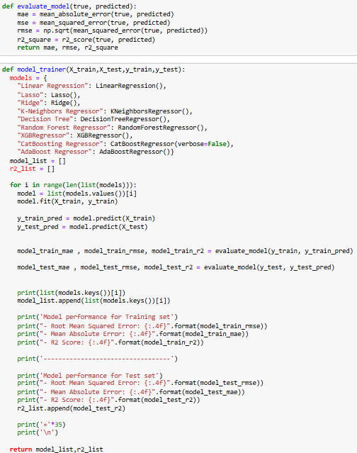
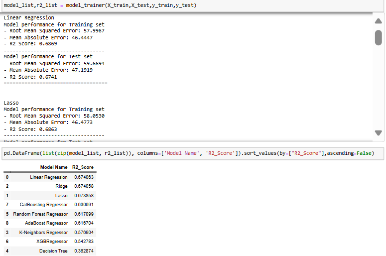
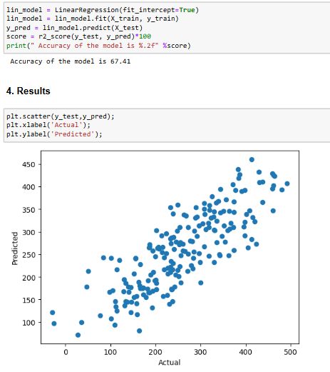
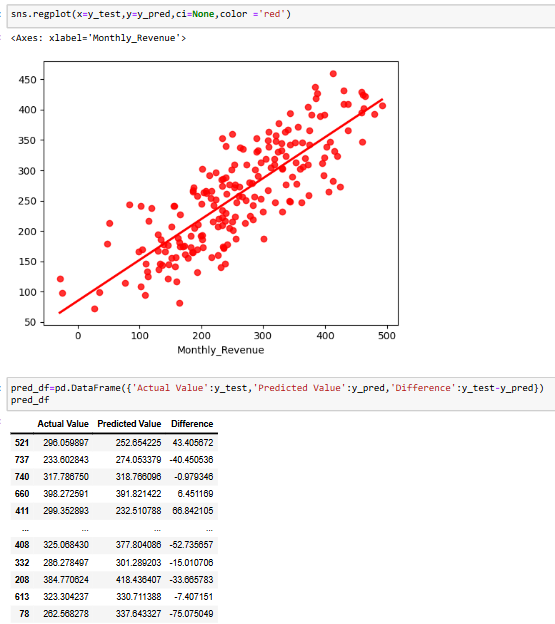
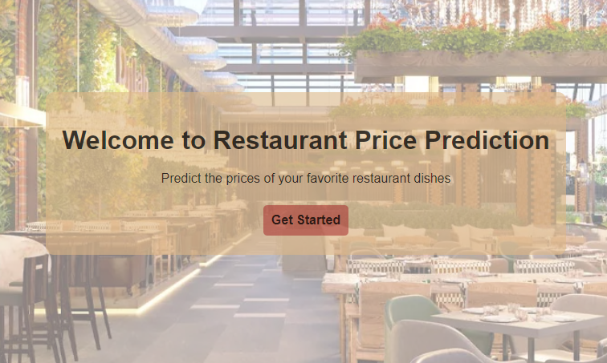
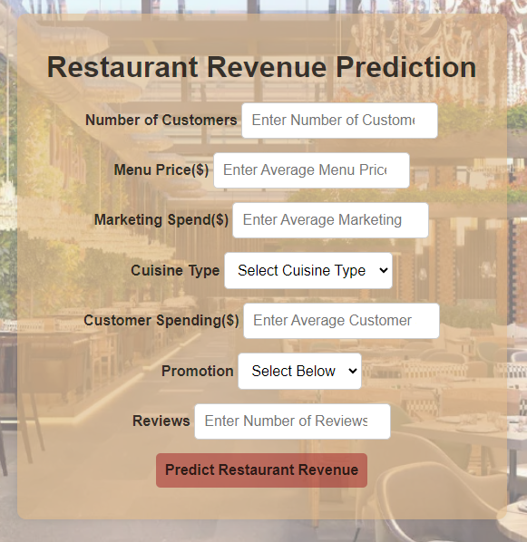
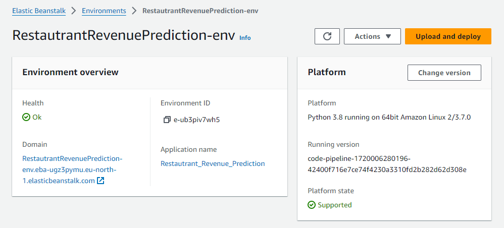
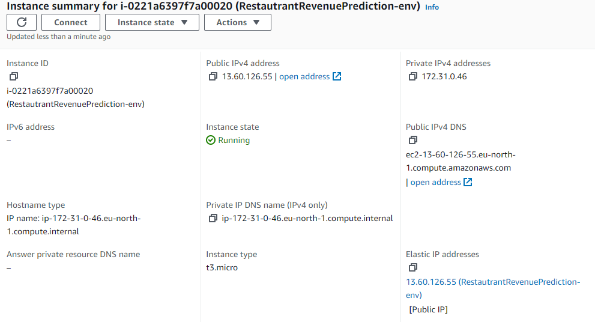
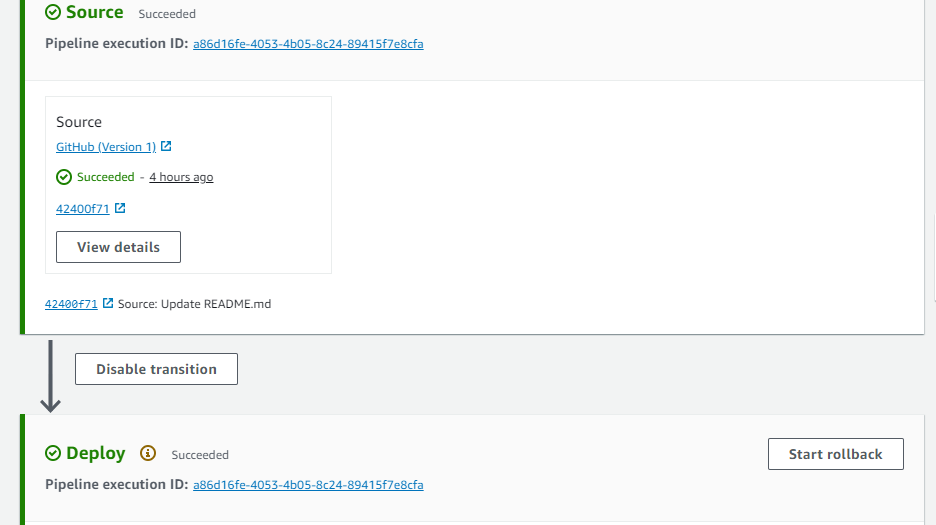

# RESTAURANT REVENUE PREDICTION


## Introduction
<a name="introduction"></a>
The "Restaurant Revenue Prediction" project aims to build a predictive model to forecast the revenue of restaurants based on a variety of features such as number of customers, type of cuisine, reviews, menu price etc. This project leverages advanced machine learning techniques and data analytics to provide actionable insights that can help restaurant owners and managers make informed decisions to optimize their revenue streams.

## Table of Contents
1. [Introduction](#introduction)
2. [Features](#features)
3. [Getting Started](#getting-started)
4. [Usage](#usage)
5. [Results](#results)
6. [Deployment](#deployment)
7. [Project Structure](#project-structure)
8. [Contributing](#contributing)

## Features
<a name="features"></a>
The project is meant to deliver the following:
1. **Revenue Prediction**: Utilizes advanced machine learning models to predict future revenues with high accuracy, helping restaurant owners forecast their earnings effectively.
2. **Comprehensive Data Analysis**: Analyzes a wide range of factors that impact restaurant revenues, including historical sales data, location demographics, customer reviews, and market trends.
3. **Key Revenue Drivers Identification**: Identifies the most influential factors that drive revenue, providing valuable insights into what contributes most to a restaurant's success.
4. **User-Friendly Interface**: Features a user-friendly interface for easy interaction with the model, allowing users to input data and receive predictions without needing extensive technical knowledge.

## Getting Started
<a name="getting-started"></a>
The project includes a Flask application implemented in `application.py`. It can be run using code editors such as VSCode. The server will be hosted locally, and the web application can be accessed by opening the browser and navigating to http://localhost:5000. To launch the web application, follow these steps:

```bash
# Clone the repository
git clone https://github.com/yc1909/Restaurant-Revenue-Prediction.git

# Navigate to the project directory
cd Restaurant-Revenue-Prediction

# Install the required dependencies
pip install -r requirements.txt

# Run the application
python application.py
```

## Usage
<a name="usage"></a>
### Data Preparation

Collect and preprocess your data:
1. **Data Collection**: Gather historical sales, customer reviews, location demographics, and market trends. The dataset in this project is acquired from: https://www.kaggle.com/datasets/mrsimple07/restaurants-revenue-prediction/data
2. **Data Cleaning**: Handle missing values, remove duplicates, and correct inconsistencies.
3. **Data Preprocessing**: Encode categorical variables, normalize numerical variables, and create new features.

### Model Training
Train the machine learning model using the prepared dataset.



### Generating Predictions
Use the trained model to generate revenue predictions.



### Visualization and Analysis
Visualize data and predictions to analyze results.



## Results
<a name="results"></a>
The final outcome of the project includes a web application that allows users to predict restaurant revenue by inputting various factors. The website features a user-friendly interface where users can enter data such as the number of customers, menu prices, marketing spend, cuisine type, customer spending, promotions, and reviews to get an estimated monthly revenue.




## Deployment
<a name="deployment"></a>

**Step-by-Step Deployment Process**
Deploy the trained model using AWS Elastic Beanstalk and CodePipeline.

**Step 1: Create Elastic Beanstalk Environment**
1. Sign in to AWS and open Elastic Beanstalk.
2. Create a new application: name it, select Python platform.
3. Configure environment: choose Web server, set instance type, upload code.
4. Create environment and wait for setup.


**Step 2: Initialize EC2 Instance**
1. Monitor environment creation in Elastic Beanstalk.
2. Ensure EC2 instance is running in the EC2 console. 


**Step 3: Create Continuous Deployment with CodePipeline**
1. Open CodePipeline in AWS.
2. Create a new pipeline: name it, select service role.
3. Add source stage: select GitHub, connect account, choose repository and branch.
4. Add deploy stage: select Elastic Beanstalk, choose application and environment.
5. Create the pipeline to start deployment.

   
**Step 4: Access the Website**
1. Obtain domain name from Elastic Beanstalk.
2. Open the domain in a browser to access the website.

## Project Structure
<a name="project-structure"></a>
```bash
Restaurant-Revenue-Prediction/
├── README.md                                            # Project documentation and overview
├── Restaurant_Revenue_Prediction.egg-info/              # Metadata about the project package
├── application.py                                       # Main application script
├── artifacts/                                           # Folder containing artifacts from the model training
│   ├── data.csv                                         # Combined dataset for analysis
│   ├── model.pkl                                        # Serialized model file
│   ├── preprocessor.pkl                                 # Serialized data preprocessing object
│   ├── test.csv                                         # Test dataset
│   ├── train.csv                                        # Training dataset
├── catboost_info/                                       # Folder for CatBoost training information
├── images/                                              # Images used in the project
│   ├── model-func.png                                   # Image explaining model functions
│   ├── model-trainer.png                                # Image showing the model training process
│   ├── predictions.png                                  # Image showing prediction results
│   ├── restaurant-img.jpg                               # Restaurant-related image
│   ├── viz-analysis.png                                 # Visualization of analysis results
├── logs/                                                # Folder containing log files
├── notebook/                                            # Jupyter notebooks for exploratory data analysis and model training
│   ├── RestaurantRevenuePrediction-EDA.ipynb            # Notebook for exploratory data analysis
│   ├── RestaurantRevenuePrediction-ModelTraining.ipynb  # Notebook for model training
│   ├── data/                                            # Data used in notebooks
│   │   ├── Restaurant_revenue.csv                       # CSV file containing restaurant revenue data
├── requirements.txt                                     # List of project dependencies
├── setup.py                                             # Script for setting up the project package
├── src/                                                 # Source code for the project
│   ├── __init__.py                                      # Init file for src module
│   ├── components/                                      # Components of the data pipeline
│   │   ├── __init__.py                                  # Init file for components module
│   │   ├── data_ingestion.py                            # Script for data ingestion
│   │   ├── data_transformation.py                       # Script for data transformation
│   │   ├── model_trainer.py                             # Script for training the model
│   ├── exception.py                                     # Custom exception handling
│   ├── logger.py                                        # Logging configuration
│   ├── pipeline/                                        # Pipeline scripts for training and prediction
│   │   ├── __init__.py                                  # Init file for pipeline module
│   │   ├── predict_pipeline.py                          # Prediction pipeline script
│   │   ├── train_pipeline.py                            # Training pipeline script
│   ├── utils.py                                         # Utility functions
├── static/                                              # Static files for the web application
│   ├── home.css                                         # CSS for the home page
│   ├── index.css                                        # CSS for the index page
│   ├── images/                                          # Static images for the web application
│   │   ├── restaurant_bg.png                            # Background image for the restaurant
├── templates/                                           # HTML templates for the web application
│   ├── home.html                                        # Home page HTML template
│   ├── index.html                                       # Index page HTML template
├── venv/                                                # Python virtual environment
```

## Contributing


